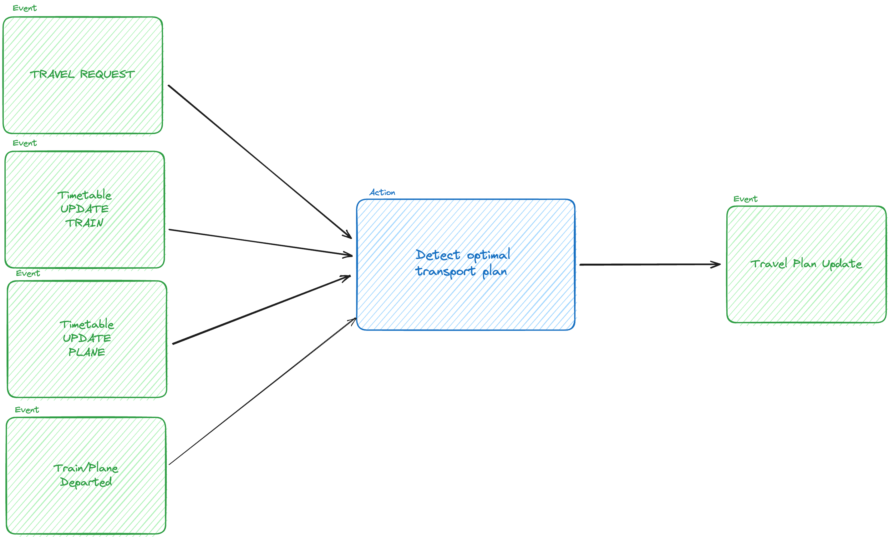
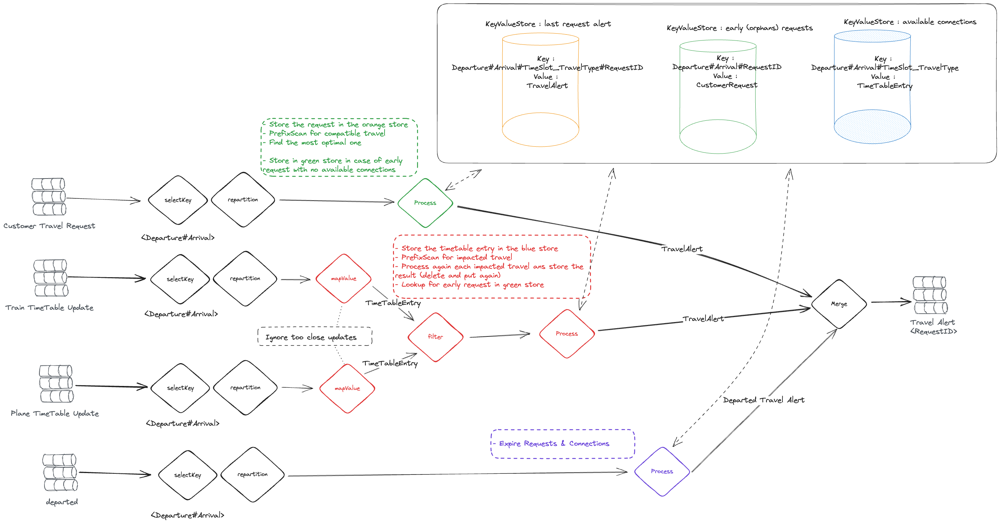

# kstreamplify-demo

This project is a demo usage of the [kstreamplify](https://github.com/michelin/kstreamplify) library that provides some
ease for use for Apache Kafka Streams framework.

It implement the same use case as
this [example project](https://github.com/ludovic-boutros/flink-kafka-stream-implementation/tree/main)

## License notes

This project is under Apache 2.0 license.

### The use case

Individuals wants to know when the next most efficient travel is planned for a specific connection (ex : DFW (Dallas) to
ATL (Atlanta))

Four existing events are available to consume (We will use a Apache Flink® Datagen job) :

- CustomerTravelRequest : a new customer emit the wish for a travel on a connection
- PlaneTimeTableUpdate : a new plane as been scheduled or moved around
- TrainTimeTableUpdate : a new train as been scheduled or moved around
- Departure : a train or plane departed

We want to manage all those scenarios :

- The customer asks for an available connection : he receive an immediate alert
- The customer asks for an unavailable connection : he will receive a notification as soon as transport solution is
  available
- An existing customer request is impacted by new transport availability or timetable update : the customer will receive
  the new optimal transportation information
- An existing customer request is impacted by a transport departure



### Apache Kafka® Streams Design



### Public / Business Data models

**DISCLAIMER** :
We consciously chose to split Train & Plane timetable updates to challenge N-Ary reconciliation capabilities of both
technologies.
We are aware that all of this could have been simplified by merging those two events in one.

The current implementation of "most efficient" is currently : the available connection that will arrive the sooner.

- [CustomerTravelRequest](models/src/main/java/org/lboutros/traveloptimizer/model/CustomerTravelRequest.java)
- [PlaneTimeTableUpdate](models/src/main/java/org/lboutros/traveloptimizer/model/PlaneTimeTableUpdate.java)
- [TrainTimeTableUpdate](models/src/main/java/org/lboutros/traveloptimizer/model/TrainTimeTableUpdate.java)
- [TravelAlert](models/src/main/java/org/lboutros/traveloptimizer/model/TravelAlert.java)
- [Departure](models/src/main/java/org/lboutros/traveloptimizer/model/Departure.java)

### Internal Data models

We only added a data model for time table updates:

- [TimeTableEntry](kstreams/src/main/java/org/lboutros/traveloptimizer/kstreams/topologies/models/TimeTableEntry.java)

## How to build

### Prerequisites

- Java 11+
- Maven 3.X

```bash
mvn clean package
```

## How to run

### Prerequisites

- Java 11+
- A consumer.properties & producer.properties files in your resource folder (here's
  a [template](flink/src/main/resources/template.properties))

## Useful Resources

- [Apache Kafka® Streams 101](https://developer.confluent.io/courses/kafka-streams/get-started/)

- [Practical Event Modeling](https://developer.confluent.io/courses/event-modeling/intro/)

- [KStreamplify](https://github.com/michelin/kstreamplify)
